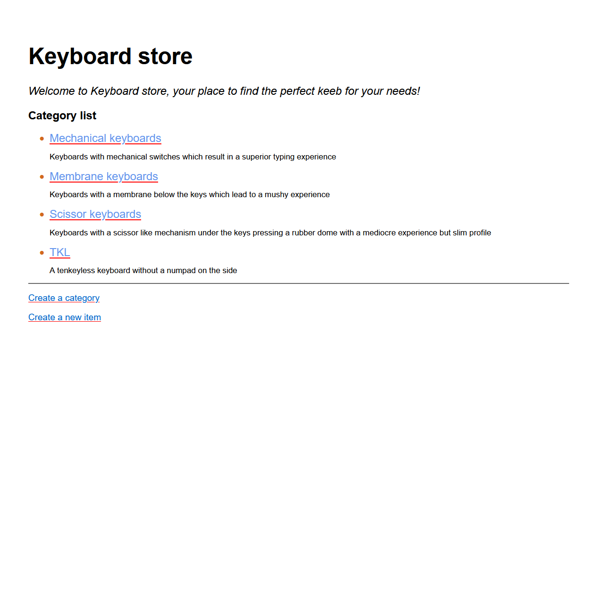

# An inventory application

This project uses Pug as a templating language for the frontend and Express, NodeJS and MongoDB for the backend. Project is meant as a practice of CRUD (Create, Read, Update or Delete) methods.

## The Odin Project: Lesson Inventory Application

This project is build according to the specification of the [Inventory Application lesson](https://www.theodinproject.com/lessons/nodejs-inventory-application)

## Live website

Access the <a href="https://inventory-application-odin.fly.dev/">inventory application</a>
